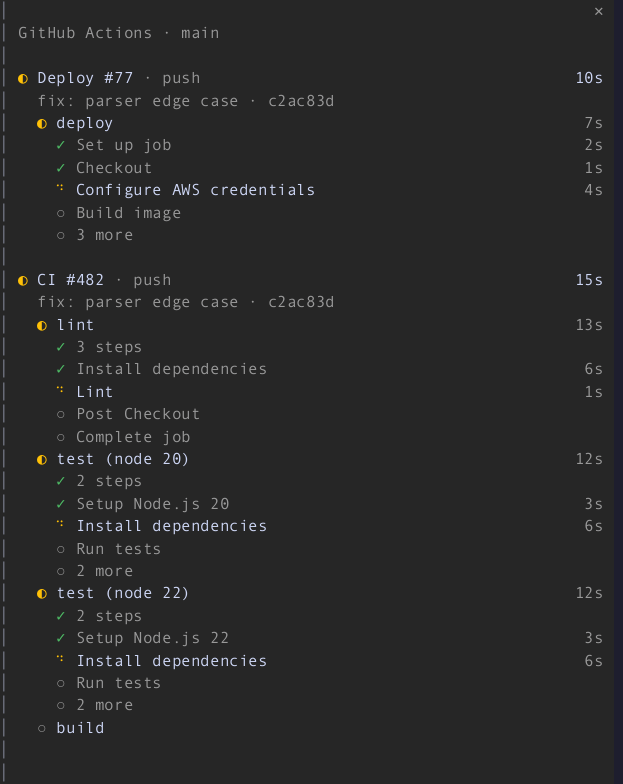
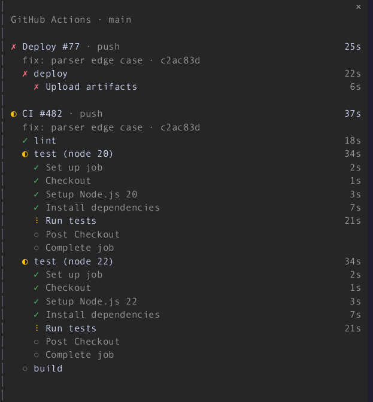
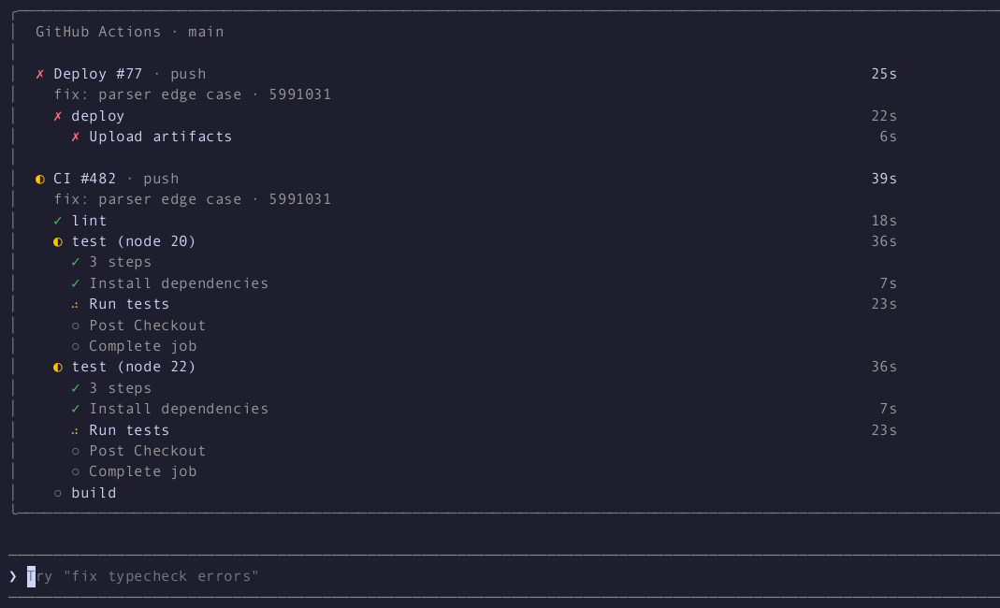
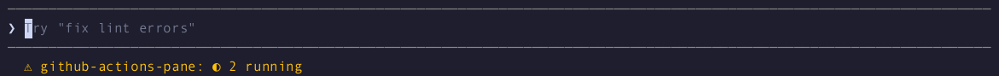

# github-actions-pane

A Claude Code mod (function-hook plugin) that shows your GitHub Actions runs
in a pane beside the transcript while they are running, drawn like GitHub's
run view: each run with its jobs, the running job's steps, status icons, and
durations that tick live.

The pane opens by itself when a run starts on your branch. Finished runs stay
for a short linger, and the pane closes itself once nothing is left to show.
A failed job collapses to the step that failed.

## Screenshots





In the main-screen layout (`CLAUDE_CODE_NO_FLICKER=0`) the pane sits above
the prompt:



Where the pane cannot seat, the status line says what is running:



## Requirements

- Claude Code 2.1.296 or later (the build it was tested on).
- Function-hook plugins (mods) are early access, and the API may change
  between releases.
- [`gh`](https://cli.github.com), logged in (`gh auth login`), and a
  checkout with a GitHub remote.

## Install

From this marketplace:

```shell
/plugin marketplace add blackpaw-studio/claude-plugins
/plugin install github-actions-pane@blackpaw-plugins
```

## Use

There is nothing to run. Push, or start a workflow, and the pane opens on the
next poll.

| Command | |
|---|---|
| `/actions` | Open the pane by hand, or close it. Opened by hand, it stays until you close it, and with nothing running it shows the latest run. |
| `/actions commit` | Watch the runs for HEAD only, for this session. |
| `/actions branch` | Watch the runs on the current branch, for this session. |
| `/actions repo` | Watch every active run in the repository, for this session. |

Click a run's name to open it on github.com (`gh run view --web`).

If you close the pane, it stays closed for the runs already in flight, and a
new run opens it again.

## Settings

These are the plugin's options. Set them when you enable it, or in `settings.json` under
`pluginConfigs["github-actions-pane"].options` (`scope`, `lingerSeconds`,
`activePollSeconds`, `idlePollSeconds`, `autoOpen`).

| Setting | Default | |
|---|---|---|
| Scope | `branch` | `commit` (HEAD), `branch` (falls back to the commit on a detached HEAD) or `repo` |
| Linger seconds | 30 | How long finished runs stay before the pane closes; 0 closes at once |
| Active poll seconds | 10 | Poll interval while a run is active; at least 5 |
| Idle poll seconds | 60 | Poll interval while nothing is active; at least 15 |
| Open automatically | on | Off: no pane opens by itself, and the status line shows what is running |

## Behaviour

- **Polling:** each poll makes one `gh run list` (20 runs, filtered to the
  scope), plus one `gh run view --json jobs` for each active run shown. When
  those 20 are all newer than a run still going, two more lists
  (`--status in_progress`, `--status queued`) find it. A run that is
  `waiting`, `requested` or `pending` and older than the newest 20 is not
  found until it moves to queued or in progress. A
  finished run's jobs are read once and then cached. A `git push`,
  `gh workflow run`, `gh pr create` or `gh run rerun` through Claude's Bash
  tool polls at once, then at the active rate for two minutes.
- **What shows:** runs that are active, plus the runs this session saw
  finish, for the linger window. A run that had already finished when it was
  first seen does not open the pane.
- **Jobs and steps:** passed jobs take one line. A running job lists its
  steps, and a failed job lists only its failed steps. A run with more than
  eight jobs folds the passed ones into "N jobs passed". When the pane is
  short, the finished steps of running jobs fold into "N steps" around the
  current one. Then older finished runs drop out, and anything still left
  over ends in "+N more".
- **Where it draws:** a pane that opens by itself seats from 144 columns,
  or from 110 once you have opened it there yourself. Narrower, it waits
  and the status line shows `◐ 2 running · ✗ 1 failed` instead. A pane
  you open with `/actions` seats at any width. In the main-screen layout it
  draws inline above the prompt, with the body capped at 96 columns.
- **Rate limits:** a rate-limited `gh` drops polling to the idle rate, and
  the header shows `rate limited` until a poll succeeds. When the data is
  more than two polls old, the header shows `stale · 40s`.
- **Off quietly:** outside a git repository, without `gh`, logged out of
  `gh`, or with no GitHub remote, nothing opens and `gh` is not polled.
  `/actions` says which one applies. A Bash `cd` into a repository starts
  watching again.
- **Terminal only:** the pane's body is drawn only in the terminal.

## Limitations

- Kicks only see commands run through Claude's Bash tool. A push from
  another terminal shows up on the next idle poll.
- The linger and the stale note use your local clock, measured from when a
  poll saw the change, not from GitHub's timestamps.
- Some terminal setups (inside tmux, for one) do not support OSC 8
  hyperlinks, so the run name is a button that runs `gh run view --web`
  rather than a link.

## Development

```sh
claude plugin validate plugins/github-actions-pane
claude plugin test plugins/github-actions-pane
```

CI (`.github/workflows/ci.yml`) runs both, plus the marketplace validation,
on every pull request. It skips `tsc`, because the declarations below need a
logged-in session to be written.

Type-checking needs the declarations the engine lays into
`.claude-plugin/types/` when it loads the mod from a folder you own (a
`--plugin-dir` or the session's mods folder). Run `tsc -p` on the
plugin folder.

`gh` fixtures in `src/testing/gh-fixtures.ts` are real `gh` output from
`cli/cli`. `dev/capture-fixtures.sh` refreshes them with read-only calls.

### The demo

The screenshots and GIF come from a real Claude Code session. That session
watches a scripted timeline that a fake `gh` (`dev/demo/bin/gh`) replays: CI
#482 with four jobs, and Deploy #77 failing at "Upload artifacts". Nothing
reaches GitHub. The demo polls at the floors (5 s active, 15 s idle).

```sh
dev/demo/record.sh full150 fullscreen 150 40 100   # also: main, other sizes
dev/demo/render.py still full150 42 docs/failure.png --crop 86,0,150,30
dev/demo/render.py gif full150 -12 92 docs/demo.gif --crop 86,0,150,35 --speed 2
```

`record.sh` runs Claude in a throwaway tmux session inside a scratch repository,
records it with asciinema, and saves `tmux capture-pane -e` frames each
second under `dev/demo/out/<name>/`. `render.py` turns a recording into
stills and a GIF with `agg` and `ffmpeg`.
