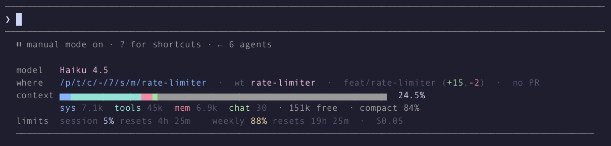
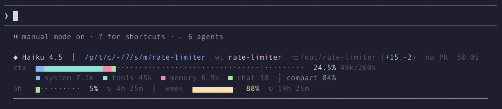
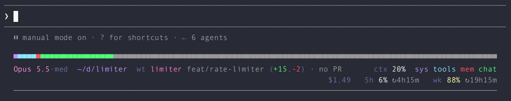
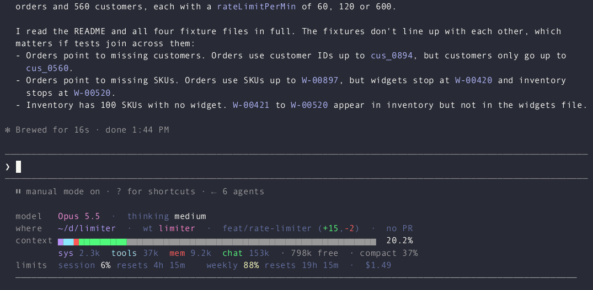

# rich-statusline

A Claude Code mod (function-hook plugin) that draws a multi-row status
dashboard under the prompt: model and effort, where you are (path, git
branch, linked worktree, uncommitted diff stats, PR), the context window broken down by
category, the 5-hour and weekly usage limits with reset countdowns, and the
session's cost.

Three layouts, switchable live (the short names 1a, 1b and 1c below refer to
them):

- **Labeled grid** (1b, the default): `model` / `where` / `context` /
  `limits` rows, a category legend ending in `· N free  · compact N%`.
- **Grouped rows** (1a): identity, a 60-cell context bar with the
  auto-compact marker, a category legend, and the limits.
- **Compact** (1c): a full-width bar and two justified rows.

Every layout ends in a full-width `─` rule.

## Screenshots






Claude Code's own permission-mode line and its hint text (`? for shortcuts`,
`esc to interrupt`, task pills) stay exactly as the engine draws them.

## Requirements

- Claude Code 2.1.289 or later.
- Function-hook plugins (mods) are early access; the API may change between
  releases.

## Install

From this marketplace:

```shell
/plugin marketplace add blackpaw-studio/claude-plugins
/plugin install rich-statusline@blackpaw-plugins
```

Then **remove any `statusLine` entry from your `settings.json`**. A mod cannot
hide the settings status line, so leaving it in place draws both.

## Settings

Run `/rich-statusline` (or `/rich-statusline settings`) to open the settings
menu in the band above the prompt; run it again to close it. Press
**ctrl+x tab** to focus the menu, then Tab or the arrow keys move between
controls and Enter changes one. **Done** (`d`) closes the menu, **Reset to
defaults** (`r`) restores the defaults. Changes apply immediately and are
saved in the plugin's store.

The menu lives in the band rather than a side pane because panes do not draw
in some terminal setups (Claude Code inside tmux, for one).

| Setting | Default | |
|---|---|---|
| Layout | Labeled grid | Grouped rows, Labeled grid or Compact |
| Show cost | on | 1a: end of the first row; 1b: limits row; 1c: before `5h` |
| Show PR | on | `#123` from `gh pr view`; `no PR` when there is none or `gh` is missing |
| Show diff stats | on | `(+12,-3)` from `git diff HEAD --shortstat`, after the branch |
| Show worktree | on | `wt <name>` before the branch inside a linked git worktree |
| Show legend | on | the category legend of 1a and 1b |
| Amber at | 70% | context and each limit turn amber from here |
| Red at | 90% | ...and red from here |
| Git refresh | 10 s | branch, worktree and diff stats |
| PR refresh | 60 s | also refreshed at once when the branch changes |

There is no keyboard shortcut: this build of the plugin API lets a Button
bind only the engine's own keybinding actions, not a plugin-defined one.

## Behaviour

- **Terminal only.** On desktop, VS Code and mobile the hint line is left as
  the engine draws it.
- **Width:** the rows fill the terminal less the 2 columns the engine indents
  the hint line by, and the breakpoints below count that same width.
- **Narrow terminals:** the context bar shrinks to fit; under 100 columns of
  row (a 102-column terminal) the legend goes; under 80 the reset countdowns
  and the PR go; under 60 the
  compact layout is used whatever is chosen. When a row still overflows, 1b's
  `· compact N%` note is the first thing its legend drops.
- **No rate limits** (API key, gateway): the limits row is hidden.
- **Before the first response:** `—` replaces the context percentage, over an
  empty bar.
- **Zero-token categories** are left out of the legends. MCP tools loaded via
  tool search are deferred (outside the window), so mcp is often 0.
- The category split uses the local `summary` estimate of `/context` (no
  token-count requests), refreshed two seconds after the context last changed.
- `git` and `gh` run through the host with a timeout; a render never waits on
  them. Outside a repository the row reads `no git` and `gh` is not asked.

## Colours

The rows use your terminal theme's own palette (its normal colour slots, plus
gray), so they follow light and dark themes alike.

## Limitations

- Column widths count characters, not display cells: a path or branch with
  wide characters (CJK, emoji) can push a 1c row past the edge, where it is
  cut off.
- Category sizes are estimates, so they need not add up to the exact
  `28k/200k` figure, which is the last API response's.

## Development

```sh
claude plugin validate plugins/rich-statusline
claude plugin test plugins/rich-statusline
```

Type-checking needs the declarations the engine lays into
`.claude-plugin/types/` when it loads the mod from a folder you own (a
`--plugin-dir` or the session's mods folder); `tsc -p` that folder.
